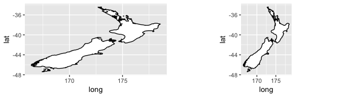
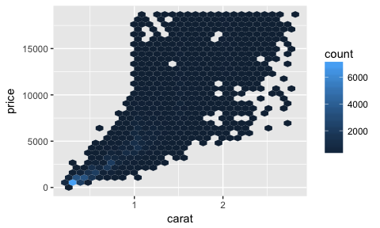
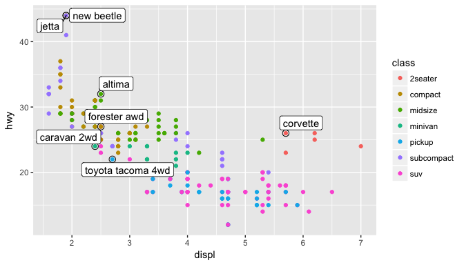

R for Data Science
================

Chapter 1: Data visualization with ggplot2
==========================================

### Organization of a typical data science project


### facet

``` r
ggplot(data = mpg) +
      geom_point(mapping = aes(x = displ, y = hwy)) +
      facet_wrap(~ class, nrow = 2)

ggplot(data = mpg) +
      geom_point(mapping = aes(x = displ, y = hwy)) +
      facet_grid(drv ~ cyl)
```

### show.legend

``` r
ggplot(data = mpg) +
      geom_smooth(
        mapping = aes(x = displ, y = hwy, color = drv),
        show.legend = FALSE )
```

### Overides the global data

``` r
 ggplot(data = mpg, mapping = aes(x = displ, y = hwy)) +
      geom_point(mapping = aes(color = class)) +
      geom_smooth(
        data = filter(mpg, class == "subcompact"),
        se = FALSE )
```

    ## `geom_smooth()` using method = 'loess'


### geom\_smooth

``` r
ggplot(data = mpg, mapping = aes(x = displ, y = hwy)) +
      geom_point(mapping = aes(color = class)) +
      geom_smooth(
        data = filter(mpg, class == "subcompact"),
        method = "loess", se = FALSE)
```

### geom\_bar

``` r
p1 <- ggplot(data = diamonds) +
      geom_bar(mapping = aes(x = cut))
p2 <- ggplot(data = diamonds) +
        geom_bar(mapping = aes(x = cut, y = ..prop.., group = 1))
grid.arrange(p1,p2,nrow=1)
```


### position

-   `position = "identity"` will place each object exactly where it falls in the context of the graph
-   `position = "fill"` works like stacking, but makes each set of stacked bars the same height
-   `position = "dodge"` places overlapping objects directly beside one another
-   `position = "jitter"` adds a small amount of random noise to each point.

### Cordinate Systems

-   `coord_flip()` switches the x- and y-axes.
-   `coord_quickmap()` sets the aspect ratio correctly for maps

``` r
nz <- map_data("nz")

p1 <- ggplot(nz, aes(long, lat, group = group)) +
        geom_polygon(fill = "white", color = "black")

p2 <- ggplot(nz, aes(long, lat, group = group)) +
        geom_polygon(fill = "white", color = "black") +
        coord_quickmap()

grid.arrange(p1,p2,nrow=1)
```



### Shortcut

In Console, Cmd + Up Arrow to list all the commands typed that start with those letter

### near

``` r
1/49*49==1 ## FALSE
near(1/49*49,1) ## TRUE
```

Chapter 3: Data Transformation with dplyr
=========================================

### dplyr Basics

-   Pick observations by their values `filter()`.
-   Reorder the rows `arrange()`.
-   Pick variables by their names `select()`.
-   Create new variables with functions of existing variables `mutate()`.
-   Collapse many values down to a single summary `summarize()`.

These can all be used in conjunction with `group_by()`

``` r
nov_dec <- filter(flights, month %in% c(11, 12)) # x %in% y
oct_dec <- filter(flights, between(month, 10, 12)) # between(x, left, right) shortcut for x >= left & x <= right

arrange(flights, year, month, day)
arrange(flights, desc(arr_delay))

select(flights, year:day) # inclusive
select(flights, -(year:day))
# within select: 
  # starts_with("abc")
  # ends_with("xyz")
  # contains("ijk")
  # num_range("x", 1:3) matches x1, x2, and x3
rename(flights, tail_num = tailnum)
select(flights, time_hour, air_time, everything())

# only keep the new variables, use transmute() instead of mutate()
transmute(flights,
      gain = arr_delay - dep_delay,
      hours = air_time / 60,
      gain_per_hour = gain / hours)
```

### group\_by() and summarize()

Together `group_by()` and `summarize()` provide one of the tools that you will use most commonly when working with dplyr: grouped summaries.

``` r
by_day <- group_by(flights, year, month, day) 
summarize(by_day, delay = mean(dep_delay, na.rm = TRUE))

delays <- flights %>%
      group_by(dest) %>%
      summarize(
        count = n(),
        dist = mean(distance, na.rm = TRUE),
        delay = mean(arr_delay, na.rm = TRUE)
        delay2 = mean(arr_delay[arr_delay > 0])) %>%
      filter(count > 20, dest != "HNL")
```

Whenever you do any aggregation, it is always a good idea to include either a count `n()`, or a count of nonmissing values `sum(!is.na(x))`.

There is much greater variation in the average delay when there are few flights. It is often useful to filter out the groups with the smallest numbers of observations, so you can see more of the pattern and less of the extreme variation in the smallest groups.

### Useful Summary Functions

-   Measure of location: `mean(x)`, `median(x)`
-   Measure of spread: `sd(x)`, `IQR(x)`, `mad(x)` (Median Absolute Deviation)
-   Measure of rank: `min(x)`, `max(x)`, `quantile(x, 0.25)` finds a value of x that is greater than 25%, less than 75%
-   Measures of position `first(x)`, `last(x)`, `nth(x, nth)`
-   Counts `n(x)`, `n(x, wt)` yields the sum of `wt`: weight variable of each value in `x`, `n_distinct()` count the number of distince values
-   Counts and proportions of logical values `sum(x > 10)`, `mean(y == 0)`

### Grouped Mutates (and Filters)

Grouping is most useful in conjunction with `summarize()`, but it is also convenient operations with `mutate()` and `filter()`:

-   Find the worst members of each group (lowest 10):

``` r
flights_sml %>%
          group_by(year, month, day) %>%
          filter(rank(desc(arr_delay)) < 10)
```

-   Find all groups bigger than a threshold:

``` r
popular_dests <- flights %>%
        group_by(dest) %>%
        filter(n() > 365)
```

-   Standardize to compute per group metrics:

``` r
popular_dests %>%
        filter(arr_delay > 0) %>%
        mutate(prop_delay = arr_delay / sum(arr_delay)) %>%
        select(year:day, dest, arr_delay, prop_delay)
```

Chapter 5: Exploratoy Data Analysis
===================================

### Visualizing Distributions

Visualizing the distribution of a variable will depend on whether the variable is categorical or continuous.

-   Categorical variable: `geom_bar()`
-   Continuous variable: `geom_histogram()`

In order to overlay multiple histograms in the same plot, using `geom_freqpoly()` instead of `geom_histogram()`. `geom_freqpoly()` instead of displaying the counts with bars, uses lines instead. 

### Unusual values

If you encountered unusual values in your dataset, you have two options: Drop the entire row with the strange values; Instead, I recommend replacing the unusual values with missing values.

The easiest way to do this is to use `mutate()` to replace the variable with a modified copy. You can use the `ifelse()` function to replace unusual values with `NA`:

``` r
diamonds2 <- diamonds %>%
  mutate(y = ifelse(y < 3 | y > 20, NA, y))
ggplot(data = diamonds2, mapping = aes(x = x, y = y)) +
  geom_point(na.rm = TRUE) # Suppress the warning that 9 rows removed containging missing values
```

### Covariation

#### A Categorical and Continuous Variable

If variation describes the behavior within a variable, covariation describes the behavior between variables. The best way to spot covariation is to visualize the relationship between two or more variables.

It’s common to want to explore the distribution of a continuous variable broken down by a categorical variable, as in the previous frequency polygon.

``` r
ggplot(data = diamonds, mapping = aes(x = price)) +
    geom_freqpoly(mapping = aes(color = cut), binwidth = 500)
```

To make the comparison easier we need to swap what is displayed on the y-axis. Instead of displaying count, we’ll display density, which is the count standardized so that the area under each frequency polygon is one:

``` r
ggplot(data = diamonds,
    mapping = aes(x = price, y = ..density..) ) +
    geom_freqpoly(mapping = aes(color = cut), binwidth = 500)
```

Another alternative to display the distribution of a continuous variable broken down by a categorical variable is the boxplot (You can do that with `coord_flip())`.

``` r
ggplot(data = mpg) +
    geom_boxplot(
  mapping = aes(x = reorder(class, hwy, FUN = median), y=hwy))
```


#### Two Categorical Variables

To visualize the covariation between categorical variables, you’ll need to count the number of observations for each combination. One way to do that is to rely on the built-in `geom_count()`:

``` r
ggplot(data = diamonds) +
    geom_count(mapping = aes(x = cut, y = color))
```

Another approach is to compute the count with `dplyr`, then visualize with `geom_tile()` and the fill aesthetic:

``` r
diamonds %>%
    count(color, cut)
diamonds %>%
    count(color, cut) %>%
    ggplot(mapping = aes(x = color, y = cut)) +
      geom_tile(mapping = aes(fill = n))
```

#### Two Continuous Variables

One great way to visualize the covariation between two continuous variables: draw a scatterplot with `geom_point()`. Scatterplots become less useful as the size of your dataset grows. One way to fix the problem, using the alpha aesthetic to add transparency. But using transparency can be challenging for very large datasets.

Another solution is to use `bin` in `geom_bin2d()` and `geom_hex()` (required packge `methods` and `hexbin`) in two dimensions.

``` r
ggplot(data = smaller) +
    geom_hex(mapping = aes(x = carat, y = price))
```



Another option is to bin one continuous variable so it acts like a categorical variable. Then you can use one of the techniques for visualizing the combination of a categorical and a continuous variable

``` r
ggplot(data = smaller, mapping = aes(x = carat, y = price)) +
    geom_boxplot(mapping = aes(group = cut_width(carat, 0.1)))
```


`cut_width(x, width)`, divides x into bins of width width. By default, boxplots look roughly the same (apart from the number of outliers) regardless of how many observations there are, so it’s difficult to tell that each boxplot summarizes a different number of points. One way to show that is to make the width of the box‐plot proportional to the number of points with `varwidth = TRUE`.

``` r
ggplot(data = smaller, mapping = aes(x = carat, y = price)) +
    geom_boxplot(mapping = aes(group = cut_width(carat, 0.1)), varwidth = TRUE)
```


Another approach is to display approximately the same number of points in each bin. That’s the job of `cut_number()`:

``` r
ggplot(data = smaller, mapping = aes(x = carat, y = price)) +
      geom_boxplot(mapping = aes(group = cut_number(carat, 20)))
```


Chapter 7: Tibbles with tibble
==============================

### Tibbles

`Tibbles` are data frames, but slightly tweaked to work better in the `tidyverse`.

-   `int` stands for integers
-   `dbl` stands for doubles, or real numbers
-   `chr` stands for character vectors, or strings
-   `dttm` stands for date-times (a date + a time)
-   `lgl` stands for logical, vectors that contain only TRUE or FALSE
-   `fctr` stands for factors, which R uses to represent categorical variables with fixed possible values
-   `date` stands for dates

### Creating Tibbles

Most R packages use regular data frames, so you might want to coerce a data frame to a tibble with `as_tibble()`.

You can create a new tibble:

``` r
tibble( x=1:5, y=1, z=x^2+y )
```

`tibble()` does much less:

-   never changes the type of the inputs (e.g., it never converts strings to factors!),
-   never changes the names of variables,
-   never creates row names
-   possible to have column names that are not valid R variable names

Printing: Tibbles have a refined print method that shows only the first 10 rows, and all the columns that fit on screen. Otherwise `print(n = 20, width = Inf)`

Some older functions don’t work with tibbles. If you encounter one of these functions, use `as.data.frame()`.

The main reason that some older functions don’t work with tibbles is the `[` function. With base R data frames, `[` sometimes returns a data frame, and sometimes returns a vector. With tibbles, `[` always returns another tibble.

Chapter 8: Data Import with readr
=================================

Most common functions (for now) and all produce tibbles:

-   `read_csv()` reads comma-delimited files
-   `read_csv2()` reads semicolon-separated files
-   `read_tsv()` reads tab-delimited files,
-   `read_delim()` reads in files with any delimiter

Options in `readr`:

-   skip n lines, `skip = n`,
-   First line of the data is default as the column names, if not `col_names = FALSE`,
-   or pass `col_names` a character vector `col_names = c("x", "y", "z"))`,
-   dealing with `na`: `read_csv("a,b,c\n1,2,.", na = ".")`

### Writing to a File

-   `write_csv()`
-   `write_excel_csv()`

### Other types of data

-   Use **haven** reads SPSS, Stata, and SAS files
-   Use **readxl** reads Excel files (both .xls and .xlsx)
-   Use **DBI** along with a database-specific backend (e.g., RMySQL, RSQLite, RPostgreSQL, etc.) allows you to run SQL queries against a database and return a data frame
-   For hierarchical data: use **jsonlite** (by Jeroen Ooms) for JSON, and **xml2** for XML

Chapter 9: Tidy Data with tidyr
===============================

### Tidy Data

`table1` --&gt; **THE ONLY TIDY DATA**

``` r
#>       country  year  cases population
#>         <chr> <int>  <int>      <int>
#> 1 Afghanistan  1999    745   19987071
#> 2 Afghanistan  2000   2666   20595360
#> 3      Brazil  1999  37737  172006362
#> 4      Brazil  2000  80488  174504898
#> 5       China  1999 212258 1272915272
#> 6       China  2000 213766 1280428583
```

`table2`

``` r
#> country        year        type     count
#> <chr>         <int>        <chr>    <int>
#> 1 Afghanistan  1999       cases       745
#> 2 Afghanistan  1999  population  19987071 
#> 3 Afghanistan  2000       cases      2666 
#> 4 Afghanistan  2000  population  20595360 
#> 5 Brazil       1999       cases     37737 
#> 6 Brazil       1999  population 172006362 
#> # ... with 6 more rows
```

`table3`

``` r
#>       country  year         rate
#> *       <chr> <int>        <chr>
#> 1 Afghanistan  1999       745/19987071
#> 2 Afghanistan  2000      2666/20595360             
#> 3      Brazil  1999    37737/172006362
#> 4      Brazil  2000    80488/174504898
#> 5       China  1999  212258/1272915272
#> 6       China  2000  213766/1280428583
```

`table4a`

``` r
# CASES
#>        country   `1999`  `2000` 
#> *        <chr>   <int>   <int> 
#> 1  Afghanistan     745    2666 
#> 2       Brazil   37737   80488 
#> 3        China  212258  213766
```

`table4b`

``` r
# POPULATION
#>        country     `1999`      `2000` 
#> *        <chr>      <int>       <int> 
#> 1  Afghanistan   19987071    20595360 
#> 2       Brazil  172006362   174504898 
#> 3        China 1272915272  1280428583
```

There are three interrelated rules which make a dataset tidy:

1.  Each variable must have its own column
2.  Each observation must have its own row
3.  Each value must have its own cell

Typically a dataset will only suffer from one of these two problems:

1.  One variable might be spread across multiple columns
2.  One observation might be scattered across multiple rows

### Gathering

A common problem is a dataset where some of the column names are not names of variables, but values of a variable. We need to gather those columns into a new pair of variables. Take `table4a`.

To tidy a dataset like this, we need to gather those columns into a new pair of variables. To describe that operation we need three parameters:

-   The set of columns that represent values, not variables. In this example, those are the columns `1999` and `2000`
-   The name of the variable whose values form the column names. I call that the `key`, and here it is`year`
-   The name of the variable whose values are spread over the cells. I call that `value`, and here it’s the number of `cases`

``` r
table4a %>% gather(`1999`, `2000`, key = "year", value = "cases")
```

``` r
  # country     year   cases 
#   <chr>       <chr>  <int>
# 1 Afghanistan 1999     745
# 2 Brazil      1999   37737
# 3 China       1999  212258
# 4 Afghanistan 2000    2666
# 5 Brazil      2000   80488
# 6 China       2000  213766
```

### Spreading

Spreading is the opposite of gathering. You use it when an observation is scattered across multiple rows. For example, take `table2`— an observation is a country in a year, but each observation is spread across two rows:

To tidy this up, we first analyze the representation in a similar way to`gather()`. This time, however, we only need two parameters:

-   The column that contains variable names, the key column. Here, it’s `type`
-   The column that contains values forms multiple variables, the value column. Here, it’s `count`

``` r
spread(table2, key = type, value = count)
```

``` r
#   country      year  cases population
#   <chr>       <int>  <int>      <int>
# 1 Afghanistan  1999    745   19987071
# 2 Afghanistan  2000   2666   20595360
# 3 Brazil       1999  37737  172006362
# 4 Brazil       2000  80488  174504898
# 5 China        1999 212258 1272915272
# 6 China        2000 213766 1280428583
```

As you might have guessed from the common key and value argu‐ ments, `spread()` and `gather()` are complements. `gather()` makes wide tables narrower and longer; `spread()` makes long tables shorter and wider.

### Separate

`separate()` pulls apart one column into multiple columns, by splitting wherever a separator character appears. Take `table3`. By default, `separate()` will split values wherever it sees a non- alphanumeric character:

``` r
table3 %>% separate(rate, into = c("cases", "population"))

table3 %>% separate(rate, into = c("cases", "population"), sep = "/")
```

case and population are character columns. This is the default behavior in `separate()`: it leaves the type of the column as is. Here, however, it iss not very useful as those really are numbers. We can ask `separate()` to try and convert to better types using `convert = TRUE`:

``` r
table3 %>% separate(rate, into = c("cases", "population"), convert = TRUE)
```

You can use this arrangement to separate the last two digits of each year:

``` r
table3 %>% separate(year, into = c("century", "year"), sep = 2)
```

### Unite

`unite()` is the inverse of `separate()`: it combines multiple columns into a single column. The default will place an underscore between the values from different columns.

``` r
table5 %>% unite(new, century, year)

table5 %>% unite(new, century, year, sep = "")
```

### Missing Values

A value can be missing in one of two possible ways:

-   Explicitly, i.e., flagged with `NA`
-   Implicitly, i.e., simply not present in the data

``` r
#    year   qtr return
#   <dbl> <dbl>  <dbl>
# 1  2015     1   1.88
# 2  2015     2   0.59
# 3  2015     3   0.35
# 4  2015     4  NA   
# 5  2016     2   0.92
# 6  2016     3   0.17
# 7  2016     4   2.66
```

There are two missing values in this dataset:

-   The return for the fourth quarter of 2015 is explicitly missing, because the cell where its value should be instead contains `NA`.
-   The return for the first quarter of 2016 is implicitly missing, because it simply does not appear in the dataset.

The way that a dataset is represented can make implicit values explicit:

``` r
stocks %>% complete(year, qtr)
```

``` r
#    year   qtr return
#   <dbl> <dbl>  <dbl>
# 1  2015     1   1.88
# 2  2015     2   0.59
# 3  2015     3   0.35
# 4  2015     4  NA   
# 5  2016     1  NA   
# 6  2016     2   0.92
# 7  2016     3   0.17
# 8  2016     4   2.66
```

Sometimes when a data source has primarily been used for data entry, missing values indicate that the previous value should be carried forward:

``` r
#   person           treatment response
#   <chr>                <dbl>    <dbl>
# 1 Derrick Whitmore         1        7
# 2 NA                       2       10
# 3 NA                       3        9
# 4 Katherine Burke          1        4
```

`fill()` takes a set of columns with missing values to be replaced by the most recent nonmissing value

``` r
treatment %>% fill(person)
```

``` r
#   person           treatment response
#   <chr>                <dbl>    <dbl>
# 1 Derrick Whitmore         1        7
# 2 Derrick Whitmore         2       10
# 3 Derrick Whitmore         3        9
# 4 Katherine Burke          1        4
```

### Case Study

``` r
who
# A tibble: 7,240 x 60
#    country     iso2  iso3   year new_sp_m014 new_sp_m1524 new_sp_m2534 new_sp_m3544 new_sp_m4554
#    <chr>       <chr> <chr> <int>       <int>        <int>        <int>        <int>        <int>
#  1 Afghanistan AF    AFG    1980          NA           NA           NA           NA           NA
#  2 Afghanistan AF    AFG    1981          NA           NA           NA           NA           NA
#  3 Afghanistan AF    AFG    1982          NA           NA           NA           NA           NA
#  4 Afghanistan AF    AFG    1983          NA           NA           NA           NA           NA
#  5 Afghanistan AF    AFG    1984          NA           NA           NA           NA           NA
#  6 Afghanistan AF    AFG    1985          NA           NA           NA           NA           NA
#  7 Afghanistan AF    AFG    1986          NA           NA           NA           NA           NA
#  8 Afghanistan AF    AFG    1987          NA           NA           NA           NA           NA
#  9 Afghanistan AF    AFG    1988          NA           NA           NA           NA           NA
# 10 Afghanistan AF    AFG    1989          NA           NA           NA           NA           NA
# ... with 7,230 more rows, and 51 more variables: new_sp_m5564 <int>, new_sp_m65 <int>,
#   new_sp_f014 <int>, new_sp_f1524 <int>, new_sp_f2534 <int>, new_sp_f3544 <int>, new_sp_f4554 <int>,
#   new_sp_f5564 <int>, new_sp_f65 <int>, new_sn_m014 <int>, new_sn_m1524 <int>, new_sn_m2534 <int>,
#   new_sn_m3544 <int>, new_sn_m4554 <int>, new_sn_m5564 <int>, new_sn_m65 <int>, new_sn_f014 <int>,
#   new_sn_f1524 <int>, new_sn_f2534 <int>, new_sn_f3544 <int>, new_sn_f4554 <int>, new_sn_f5564 <int>,
#   new_sn_f65 <int>, new_ep_m014 <int>, new_ep_m1524 <int>, new_ep_m2534 <int>, new_ep_m3544 <int>,
#   new_ep_m4554 <int>, new_ep_m5564 <int>, new_ep_m65 <int>, new_ep_f014 <int>, new_ep_f1524 <int>,
#   new_ep_f2534 <int>, new_ep_f3544 <int>, new_ep_f4554 <int>, new_ep_f5564 <int>, new_ep_f65 <int>,
#   newrel_m014 <int>, newrel_m1524 <int>, newrel_m2534 <int>, newrel_m3544 <int>, newrel_m4554 <int>,
#   newrel_m5564 <int>, newrel_m65 <int>, newrel_f014 <int>, newrel_f1524 <int>, newrel_f2534 <int>,
#   newrel_f3544 <int>, newrel_f4554 <int>, newrel_f5564 <int>, newrel_f65 <int>
```

``` r
who %>%
  gather(code, value, new_sp_m014:newrel_f65, na.rm = TRUE) %>% 
  mutate(code = stringr::str_replace(code, "newrel", "new_rel")) %>%
  separate(code, c("new", "var", "sexage")) %>%
  select(-new, -iso2, -iso3) %>%
  separate(sexage, c("sex", "age"), sep = 1)
```

``` r
# A tibble: 76,046 x 6
#    country      year var   sex   age   value
#    <chr>       <int> <chr> <chr> <chr> <int>
#  1 Afghanistan  1997 sp    m     014       0
#  2 Afghanistan  1998 sp    m     014      30
#  3 Afghanistan  1999 sp    m     014       8
#  4 Afghanistan  2000 sp    m     014      52
#  5 Afghanistan  2001 sp    m     014     129
#  6 Afghanistan  2002 sp    m     014      90
#  7 Afghanistan  2003 sp    m     014     127
#  8 Afghanistan  2004 sp    m     014     139
#  9 Afghanistan  2005 sp    m     014     151
# 10 Afghanistan  2006 sp    m     014     193
# ... with 76,036 more rows
```

Chapter 10: Relational Data with dplyr
======================================

### Mutating Joins and Mutate

``` r
flights2 <- flights %>% select(year:day, hour, origin, dest, tailnum, carrier)

flights2 %>% left_join(airlines, by = "carrier")

flights2 %>% mutate(name = airlines$name[match(carrier, airlines$carrier)])
```

But this is hard to generalize when you need to match multiple variables with the use of `mutate()`

### Inner Join

The most important property of an inner join is that unmatched rows are not included in the result. This means that **generally inner joins are usually not appropriate for use in analysis because it’s too easy to lose observations**.

``` r
x %>% inner_join(y, by = "key")
```

### Outer Joins

An *outer join* keeps observations that appear in at least one of the tables. There are three types of outer joins:

-   A left join keeps all observations in `x`
-   A right join keeps all observations in `y`
-   A full join keeps all observations in `x` and `y`


### Duplicate Keys

When the keys are not unique, there are two possibilities:

-   One table has duplicate keys. This is useful when you want to add in additional information as there is typically a one-to-many relationship
-   Both tables have duplicate keys. This is usually an error because in neither table do the keys uniquely identify an observation. When you join duplicated keys, you get all possible combinations, the Cartesian product

### Defining the Key Columns

-   The default, `by = NULL`, uses all variables that appear in both tables, the so-called natural join
-   A character vector, `by = "x"` uses only some of the common variables
-   A named character vector: `by = c("a" = "b")`. This will match variable `a` in table `x` to variable `b` in table `y`.

### Filtering Joins

Filtering joins match observations in the same way as mutating joins, but affect the observations, not the variables. There are two types:

-   `semi_join(x, y)` keeps all observations in `x` that have a match in `y`
-   `anti_join(x, y)` drops all observations in `x` that have a match in `y`.

Semi-joins are useful for matching filtered summary tables back to the original rows. For example, imagine you’ve found the top-10 most popular destinations:

``` r
top_dest <- flights %>% count(dest, sort = TRUE) %>% head(10)

flights %>% semi_join(top_dest)
```

Anti-joins are useful for diagnosing join mismatches. For example, when connecting flights and planes, you might be interested to know that there are many flights that don’t have a match in planes:

``` r
flights %>% anti_join(planes, by = "tailnum") %>% 
  count(tailnum, sort = TRUE)
```

### Set Operations

All these operations work with a complete row, comparing the values of every variable. These expect the `x` and `y` inputs to have the same variables, and treat the observations like sets:

-   `intersect(x, y)` --&gt; Return only observations in both `x` and `y`
-   `union(x, y)` --&gt; Return unique observations in `x` and `y`
-   `setdiff(x, y)` --&gt; Return observations in `x`, but not in `y`

Chapter 11: Strings with stringr
================================

**stringr** is not part of the core **tidyverse**, so we need to load it explicitly.

There are a handful of special characters. The most common are `"\n"`, newline, and `"\t"`, tab, but you can see the complete list by requesting help on `?'"'`, or `?"'"`.

Beware that the printed representation of a string is not the same as string itself, because the printed representation shows the escapes. To see the raw contents of the string, use `writeLines()`:

Base R contains many functions to work with strings but we’ll avoid them because they can be inconsistent, which makes them hard to remember. Instead we’ll use functions from **stringr**. These have more intuitive names, and all start with `str_`.

``` r
str_length(c("a", "R for data science", NA))
#> [1] 1 18 NA

str_c("x", "y", "z") 
#> [1] "xyz"

x <- c("Apple", "Banana", "Pear") 
str_sub(x, 1, 3)
#> [1] "App" "Ban" "Pea"

str_to_lower(str_sub(x, 1, 1))
str_to_upper()

str_sort()
str_order()
```

Chapter 12: Factors with forcats
================================

To work with factors, we’ll use the **forcats** package, which provides tools for dealing with categorical variables. It provides a wide range of helpers for working with factors. **forcats** is not part of the core **tidyverse**, so we need to load it explicitly.

``` r
x1 <- c("Dec", "Apr", "Jan", "Mar")
x2 <- c("Dec", "Apr", "Jam", "Mar") # typos

sort(x1) # Does not sort in useful way
#> [1] "Apr" "Dec" "Jan" "Mar"
```

``` r
month_levels <- c(
      "Jan", "Feb", "Mar", "Apr", "May", "Jun",
      "Jul", "Aug", "Sep", "Oct", "Nov", "Dec")
y1 <- factor(x1, levels = month_levels)
sort(y1) #> [1] Jan Mar Apr Dec
y2 <- factor(x2, levels = month_levels) # any value not in the set will be silently converted to NA
y2 #> [1] Dec Apr <NA> Mar
y2 <- parse_factor(x2, levels = month_levels) # error notification
#> Warning: 1 parsing failure.
```

### General Social Survey

Without vs Without reording the levels of `relig` using `fct_reorder()`.`fct_reorder()` takes two main arguments:

-   `f`, the factor whose levels you want to modify.
-   `x`, a numeric vector that you want to use to reorder the levels.

``` r
p1 <- relig %>% ggplot(aes(tvhours, relig)) + geom_point()
p2 <- relig %>% mutate(relig = fct_reorder(relig, tvhours)) %>% 
  ggplot(aes(tvhours, relig)) + geom_point()
grid.arrange(p1, p2, nrow=1)          
```


In order to pull certain variables to the front you can use `fct_relevel()`. It takes a factor, `f`, and then any number of levels that you want to move:

``` r
rincome <- gss_cat %>%
      group_by(rincome) %>%
      summarize(age = mean(age, na.rm = TRUE), tvhours = mean(tvhours, na.rm = TRUE), n=n())

p1 <- ggplot(rincome, aes(age, rincome)) + geom_point()
p2 <- ggplot(rincome, aes(age, fct_relevel(rincome, "Not applicable"))) + geom_point()
grid.arrange(p1, p2, nrow=1)
```


### Modifying Factor Levels

``` r
gss_cat %>% count(partyid)
# A tibble: 10 x 2
#    partyid                n
#    <fct>              <int>
#  1 No answer            154
#  2 Don't know             1
#  3 Other party          393
#  4 Strong republican   2314
#  5 Not str republican  3032
#  6 Ind,near rep        1791
#  7 Independent         4119
#  8 Ind,near dem        2499
#  9 Not str democrat    3690
# 10 Strong democrat     3490
```

In order to tweak the factor for useful meaning and combine groups, you can assign multiple old levels to the same new level.

``` r
gss_cat %>%
  mutate(partyid = fct_recode(partyid,
    "Republican, strong"    = "Strong republican",
    "Republican, weak"      = "Not str republican",
    "Independent, near rep" = "Ind,near rep",
    "Independent, near dem" = "Ind,near dem",
    "Democrat, weak" = "Not str democrat",
    "Democrat, strong" = "Strong democrat",
    "Other" = "No answer",
    "Other" = "Don't know",
    "Other" = "Other party")) %>%
  count(partyid)
# A tibble: 8 x 2
#   partyid                   n
#   <fct>                 <int>
# 1 Other                   548
# 2 Republican, strong     2314
# 3 Republican, weak       3032
# 4 Independent, near rep  1791
# 5 Independent            4119
# 6 Independent, near dem  2499
# 7 Democrat, weak         3690
# 8 Democrat, strong       3490
```

You must use this technique with care: **if you group together categories that are truly different you will end up with misleading results**.

If you want to collapse a lot of levels, `fct_collapse()` is a useful variant of `fct_recode()`. For each new variable, you can provide a vector of old levels:

``` r
gss_cat %>%
  mutate(partyid = fct_collapse(partyid,
        other = c("No answer", "Don't know", "Other party"),
        rep = c("Strong republican", "Not str republican"),
        ind = c("Ind,near rep", "Independent", "Ind,near dem"),
        dem = c("Not str democrat", "Strong democrat"))) %>%
  count(partyid)
# A tibble: 4 x 2
#   partyid     n
#   <fct>   <int>
# 1 other     548
# 2 rep      5346
# 3 ind      8409
# 4 dem      7180
```

Chapter 14: Pipes with magrittr
===============================

When Not to Use the Pipe, Pipes are most useful for rewriting a fairly short linear sequence of operations. I think you should reach for another tool when:

-   Your pipes are longer than (say) 10 steps. In that case, create intermediate objects with meaningful names. That will make debugging easier, because you can more easily check the intermediate results, and it makes it easier to understand your code, because the variable names can help communicate intent.
-   You have multiple inputs or outputs. If there isn’t one primary object being transformed, but two or more objects being combined together, don’t use the pipe.
-   You are starting to think about a directed graph with a complex dependency structure.

All packages in the **tidyverse** automatically make `%>%` available for you, so you don’t normally load magrittr explicitly.

For assignment magrittr provides the `%<>%` operator, which allows you to replace code like:

``` r
mtcars <- mtcars %>% transform(cyl = cyl * 2)

# with 
mtcars %<>% transform(cyl = cyl * 2)
```

Chapter 15: Functions
=====================

### Writing good functions is a lifetime journey

One of the best ways to improve your reach as a data scientist is to write functions. Functions allow you to automate common tasks in a more powerful and general way than copying and pasting. Writing a function has three big advantages over using copy-and-paste:

-   You can give a function an evocative name that makes your code easier to understand
-   As requirements change, you only need to update code in one place, instead of many
-   You eliminate the chance of making incidental mistakes when you copy and paste

**You should consider writing a function whenever you’ve copied and pasted a block of code more than twice**.

It’s easier to start with working code and turn it into a function; it’s harder to create a function and then try to make it work.

If your function name is composed of multiple words, I recommend using “snake\_case,” where each lowercase word is separated by an underscore. camelCase is a popular alternative. It doesn’t really matter which one you pick; the important thing is to be consistent.

If you have a family of functions that do similar things, make sure they have consistent names and arguments. Use a common prefix to indicate that they are connected.

Another important use of comments is to break up your file into easily readable chunks.

``` r
# Load data --------------------------------------

# Plot figure ------------------------------------
```

### Choosing Names

The names of the arguments are also important. It’s worth memorizing these:

-   `x`, `y`, `z`: vectors
-   `w`: a vector of weights
-   `df`: a data frame
-   `i`, `j`: numeric indices (typically rows and columns).
-   `n`: length, or number of rows
-   `p`: number of columns

Chapter 21: R Markdown
======================

A handy reference sheet with *Help → Markdown Quick Reference*.

Shortcut to include code chunks: Cmd + Option + I

Chunk output can be customized with options, arguments supplied to the chunk header. **knitr** provides almost 60 options that you can use to customize your code chunks. The following table summarizes which types of output each option suppressess:


Normally, each knit of a document starts from a completely clean slate. It can be painful if you have some computations that take a long time. The solution is `cache = TRUE`.

“Happy Git with R”: a user-friendly introduction to Git and Git-Hub for R users.

Chapter 22: Graphics for Communication with ggplot2
===================================================

### Label

The easiest place to start when turning an exploratory graphic into an expository graphic is with good labels. You add labels with the `labs()` function. The useful labels include:

-   `title`
-   `subtitle` (adds additional detail in a smaller font beneath the title)
-   `caption` (adds text at the bottom right of the plot, often used to describe the source of the data)
-   `x`, `y` (axis) and legend title
    -   `quote()` (displays mathematical equations instead of text strings. Read about the available options in `?plotmath`)

``` r
ggplot(mpg, aes(displ, hwy)) + 
  geom_point(aes(color = class)) + 
  geom_smooth(se = FALSE, method = "loess") +
  labs( 
    title = "Fuel efficiency generally decreases with engine size",
    subtitle = "Two seaters (sports cars) are an exception because of their light weight",
    caption = "Data from fueleconomy.gov", 
    x = quote(alpha + beta + frac(delta, theta)),
    y = "pure textual string",
    color = "Car type")
```


### Annotations

In addition to labeling major components of your plot, it’s often useful to label individual observations or groups of observations:

-   `geom_text()` with an additional aesthetic: `label`
-   `geom_label()`, which draws a rectangle behind the text, with `nudge_y` parameter to move the labels slightly above the corresponding points

``` r
best_in_class <- mpg %>%
      group_by(class) %>%
      filter(row_number(desc(hwy)) == 1)

p1 <- ggplot(mpg, aes(displ, hwy)) +
      geom_point(aes(color = class)) +
      geom_text(aes(label = model), data = best_in_class)

p2 <- ggplot(mpg, aes(displ, hwy)) +
      geom_point(aes(color = class)) +
      geom_label(aes(label = model),
        data = best_in_class,
        nudge_y = 2,
        alpha = 0.5)

grid.arrange(p1, p2, nrow = 1) 
```


**ggrepel** package will automatically adjust labels so that they don’t overlap:

``` r
ggplot(mpg, aes(displ, hwy)) +
      geom_point(aes(color = class)) +
      geom_point(size = 3, shape = 1, data = best_in_class) +
      ggrepel::geom_label_repel(
        aes(label = model),
        data = best_in_class)
```



Many other `geoms` in **ggplot2** available to help annotate plot:

-   `geom_hline()` and `geom_vline()` to add reference lines. I often make them thick `(size = 2)` and white `(color = white)`, and draw them underneath the primary data layer
-   `geom_rect()` to draw a rectangle around points of interest. The boundaries of the rectangle are defined by the `xmin`, `xmax`, `ymin`, and `ymax` aesthetics.
-   `geom_segment()` with the arrow argument to draw attention to a point with an arrow, the `x` and `y` aesthetics to define the starting location, and `xend` and `yend` to define the end location.

**The only limit is your imagination (and your patience with positioning annotations to be aesthetically pleasing)!**

### Scales

The third way you can make your plot better for communication is to adjust the scales. **ggplot2** automatically adds default scales behind the scenes:

``` r
ggplot(mpg, aes(displ, hwy)) +
      geom_point(aes(color = class)) +
      scale_x_continuous() +
      scale_y_continuous() +
      scale_color_discrete()
```

Note the naming scheme for scales: `scale_` followed by the name of the aesthetic, then \_, then the name of the scale. The default scales are named according to the type of variable they align with: continuous, discrete, datetime or date.

#### Axis Ticks

There are two primary arguments that affect the appearance of the ticks on the axes: `breaks` and `labels`. `breaks` controls the position of the ticks. `labels` controls the text label associated with each tick. The most common use of `breaks` is to override the default choice:

``` r
ggplot(mpg, aes(displ, hwy)) +
  geom_point() +
  # continuous scale 
  scale_y_continuous(breaks = seq(15, 40, by = 5))
```

#### Legend Layout

Collectively axes and legends are called *guides*. You will most often use `breaks` and `labels` to tweak the axes. While they both also work for legends, there are a few other techniques you are more likely to use.

To control the overall position of the legend, you need to use a `theme()` setting. The theme setting `legend.position` controls where the legend is drawn:

``` r
ggplot(mpg, aes(displ, hwy)) +
  geom_point(aes(color = class)) + 
  theme(legend.position = "left")
```

`legend.position = "none"` to suppress the display of the legend altogether.

To control the display of individual legends, use `guides()` along with `guide_legend()` or `guide_colorbar()`.

#### Replacing a Scale

There are two types of scales you’re most likely to want to switch out: continuous position scales and color scales.

Instead of doing the transformation in the aesthetic mapping `aes(log10(carat), log10(price)`, we can instead do it with the scale. This is visually identical, except the axes are labeled on the original data scale:

``` r
ggplot(diamonds, aes(carat, price)) +
  geom_bin2d() +
  scale_x_log10() +
  scale_y_log10()
```

Another scale that is frequently customized is color, with **ColorBrewer** scales. To display all colors in the package **ColorBrewer**, `display.brewer.all()`. The ColorBrewer scales are documented online at <http://colorbrewer2.org/>

``` r
ggplot(mpg, aes(displ, hwy)) +
  geom_point(aes(color = drv)) +
  scale_color_brewer(palette = "Set1")
```

When you have a predefined mapping between values and colors, use `scale_color_manual()`.

For continuous color, you can use the built-in `scale_color_gradient()` or `scale_fill_gradient()`. If you have a diverging scale, you can use `scale_color_gradient2()`. That allows you to give, for example, positive and negative values different colors. That’s also useful if you want to distinguish points above or below the mean.

#### Zooming

There are three ways to control the plot limits:

-   Adjusting what data is plotted
-   Setting the limits in each scale
-   Settingxlimandylimincoord\_cartesian()

To zoom in on a region of the plot, it’s generally best to use `coord_cartesian()`. Compare the following two plots:

``` r
p1 <- ggplot(mpg, mapping = aes(displ, hwy)) +
        geom_point(aes(color = class)) +
        geom_smooth(method = "loess") +
        coord_cartesian(xlim = c(5, 7), ylim = c(10, 30))
p2 <- mpg %>%
      filter(displ >= 5, displ <= 7, hwy >= 10, hwy <= 30) %>%
      ggplot(aes(displ, hwy)) +
      geom_point(aes(color = class)) +
      geom_smooth(method = "loess")
grid.arrange(p1, p2, nrow = 1)
```


For example, if we extract two classes of cars and plot them separately, it’s difficult to compare the plots because all three scales (the x-axis, the y-axis, and the color aesthetic) have different ranges:

``` r
suv <- mpg %>% filter(class == "suv")
compact <- mpg %>% filter(class == "compact")

p1 <- ggplot(suv, aes(displ, hwy, color = drv)) +
        geom_point()
p2 <- ggplot(compact, aes(displ, hwy, color = drv)) +
        geom_point()
grid.arrange(p1, p2, nrow = 1)
```


You can also set the limits on individual scales. Reducing the limits is basically equivalent to subsetting the data. It is generally more useful if you want *expand* the limits, for example, to match scales across different plots. In this particular case, you could have simply used faceting, but this technique is useful more generally.

``` r
x_scale <- scale_x_continuous(limits = range(mpg$displ))
y_scale <- scale_y_continuous(limits = range(mpg$hwy))
col_scale <- scale_color_discrete(limits = unique(mpg$drv))
    
p1 <- ggplot(suv, aes(displ, hwy, color = drv)) +
        geom_point() +
        x_scale + y_scale + col_scale
p2 <- ggplot(compact, aes(displ, hwy, color = drv)) +
        geom_point() +
        x_scale + y_scale + col_scale
grid.arrange(p1, p2, nrow = 1)
```


### Themes

**ggplot2** includes eight themes by default. Many more are included in add-on packages like **ggthemes**. 
